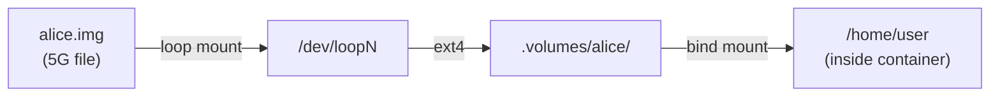

# deployment/setup-quota.sh

A container's persistent home directory (`./.volumes/<instance>`) is a
plain bind-mounted host folder by default — it can grow until the **host
disk** runs out of space. There's no Docker-native way to cap a bind mount
or a `local`-driver named volume, so `setup-quota.sh` gives an instance a
hard size cap using a **loop-mounted disk image**: a fixed-size file,
formatted with `ext4`, mounted at that instance's `.volumes/<name>`
directory.

```bash
sudo ./setup-quota.sh alice 5G
```

Both `INSTANCE` and `SIZE` are required. This creates
`.quota-images/alice.img` (a 5G file), formats it, and mounts it at
`.volumes/alice` — exactly the path `docker-compose.yml` bind-mounts to
`/home/user` for that instance. Once mounted, `alice`'s container
**physically cannot** write more than 5G to its home directory, no matter
how much free space the host disk has; QGIS sees a normal `ENOSPC` ("No
space left on device") once the cap is hit.



Because the container's `/home/user` is a bind mount of an already-mounted
filesystem, `df` run **inside** the container reports the image's real
capacity — not the host's total disk size — so users can see their own
remaining quota directly:

```bash
docker exec qgis-alice df -h /home/user
```

The script is idempotent (safe to re-run; it won't reformat an existing
image), but the mount itself does **not** survive a host reboot on its
own. Either re-run the script, or add the `/etc/fstab` line it prints at
the end to have the kernel remount it automatically at boot.
